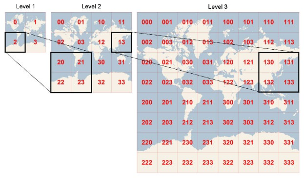

# Lightning Alert

Lightning Alert is a project that processes lightning events and generates alerts for affected assets. It provides functionalities for reading lightning events, converting coordinates to quadKeys, checking if a strike has occurred for a particular asset, and generating alerts based on lightning events and assets.

## Concept

The term "QuadKey" is derived from "quadtree key." It represents a unique code that encodes a square region in latitude and longitude space, organized by different levels of detail. At the initial level, the entire mapable surface of the Earth is divided into four QuadKeys. Think of it as a zoom level that provides a view of the entire world. Each QuadKey is represented by a single-digit code, ranging from zero to three.

As we zoom in to the next level, each of the four original QuadKeys is further divided into four, and an additional digit is added to the code. This process continues recursively, allowing for more detailed subdivision of the Earth's surface. The diagram below, sourced from the official Microsoft documentation, illustrates this progression.

For more detailed information about QuadKeys, you can refer to the official [Microsoft documentation][quadkeys-doc] on Quadkeys and Tile Grids.

[quadkeys-doc]: https://docs.microsoft.com/en-us/bingmaps/articles/bing-maps-tile-system



## Scaling and Performance Improvements
If the code needs to scale to handle many more users or more frequent strikes, you can consider implementing the following performance improvements:

1. Optimizing the data structures used: Analyze if there are more efficient data structures that can be used to store and query the lightning events and assets. One such system is H3, a hierarchical hexagonal geospatial indexing system developed by Uber. H3 uses hexagons instead of squares to represent spatial regions, providing more flexibility and efficiency in spatial operations.

2. Caching and memoization: Implement caching mechanisms to store computed results for faster access, especially for repetitive operations or expensive calculations. Caching can help avoid redundant computations and improve response times, especially for scenarios where lightning events or assets don't frequently change.

3. Parallel processing: Investigate if the code can benefit from parallelization. Identify independent operations or calculations that can be executed concurrently, utilizing multiple CPU cores effectively. Parallel processing can lead to significant performance gains, especially when dealing with large datasets or computationally intensive tasks.

4. Database optimizations: If the size of the data becomes large or the application requires complex querying, consider using a database system for efficient data storage, indexing, and querying. Geospatial databases or indexing techniques, such as quadtree or R-tree, can provide optimized spatial querying capabilities.

5. Algorithmic optimizations: Evaluate if there are any algorithmic improvements that can reduce the computational complexity of critical operations. This could involve optimizing search algorithms, spatial algorithms, or aggregations. Analyze time and space complexity, and consider alternative algorithms or data structures that offer better performance characteristics.

6. Profiling and monitoring: Measure the performance of the code using profiling tools and identify bottlenecks. Continuously monitor and analyze the system's performance to detect and address any performance issues. Profiling can help pinpoint specific areas of the code that require optimization and guide your efforts in improving performance.

## Installation

To use Lightning Alert, follow these steps:

1. Clone the repository: `https://github.com/CarlosGatti/lightning-alert.git`
2. Navigate to the project directory: `cd lightning-alert`
3. Install the dependencies: `npm install`

## Usage

The project contains the following modules:

- `lightning.js`: Provides functions for reading lightning events and converting coordinates to quadKeys.
- `alerts.js`: Implements functionalities for checking if a strike has occurred for an asset and generating alerts.

You can import and use these modules in your own code as needed.

### Conversion of Coordinates to QuadKeys

The `convertToQuadKey(latitude, longitude, precision)` function in the `lightning.js` module is used to convert latitude and longitude coordinates to quadKeys. The `latitude` and `longitude` parameters represent the coordinates of the location, and the `precision` parameter determines the level of detail in the quadKey.

Example usage:

```javascript
    const { convertToQuadKey } = require('./src/app/lightning');

    const latitude = 36.3492004;
    const longitude = -94.9762348;
    const precision = 12;

    const quadKey = convertToQuadKey(latitude, longitude, precision);
    console.log(`QuadKey for the coordinates (${latitude}, ${longitude}) is: ${quadKey}`);
```

## Folder Structure
The project follows the following folder structure:
```
|- src
|   |- app
|   |   |- lightning.js
|   |   |- assets.js
|   |   |- alerts.js
|   |- utils
|   |   |- jsonUtils.js
|   |   |- quadKeyUtils.js
|- test
|   |- lightning.test.js
|   |- assets.test.js
|   |- alerts.test.js
|- data
|   |- lightning.json
|   |- assets.json
|- docs
|   |- grid.jpeg
|- index.js
|- README.md
|- .eslintrc.json
|- package.json

```

The project directory has the following structure:

    - The project directory has the following structure:


## Dependencies
The project has the following dependencies:

    readline: Version 1.3.0
    jest: Version 29.5.0 (dev dependency)

## Getting Started
    1 - Clone the repository: git clone <repository-url>
    2 - Navigate to the project directory: cd lightning-alert
    3 - Install the dependencies: npm install or yarn install
    4 - Run the tests: npm test or yarn test
    5 - Start the application: node index.js